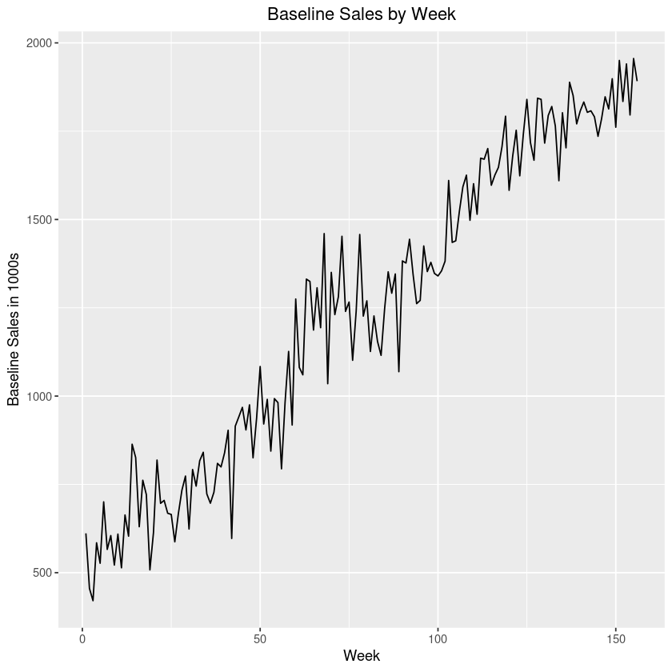
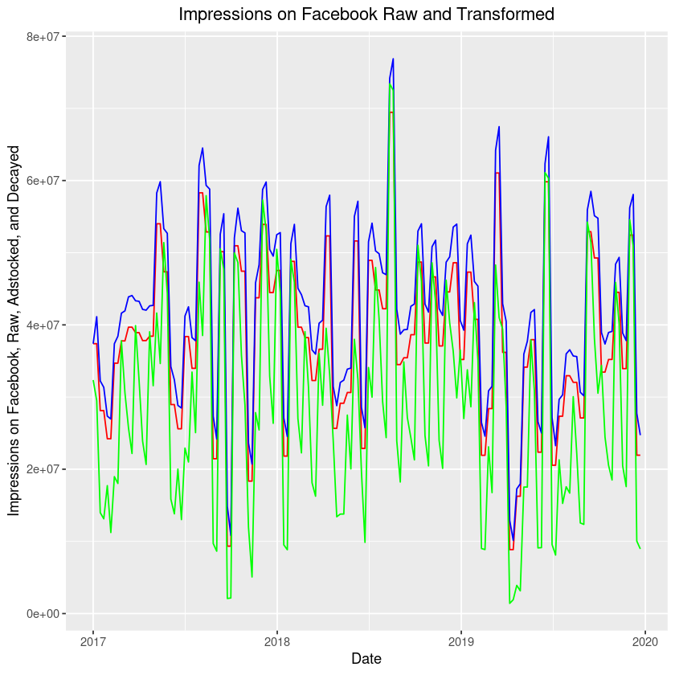
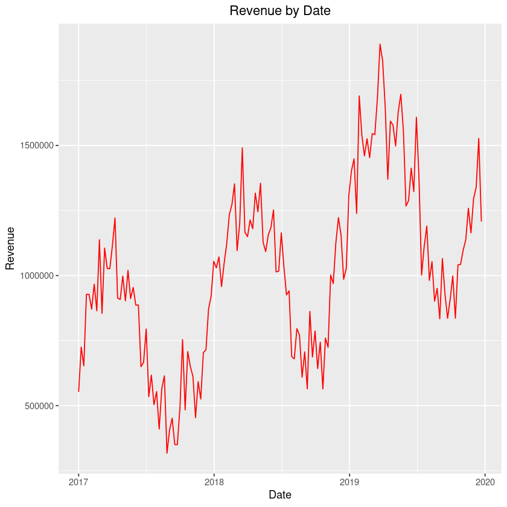

# Step-by-Step Guide

siMMMulator generates a data set using 10 steps. Each step is a function and users must run all steps to get a completed data set.

This is a detailed step-by-step users' guide. Make sure you've already followed the instructions in the [Setting up siMMMulator page](set_up.md). To see just examples of functions to run, see the [Demo Script](demo_code).

## Step 0 : Define Basic Parameters

First, provide some basic inputs that will be used to generate data. This step exists so that you don't have to keep inputting the same info.

**Example:**

Replace the parameter values with ones that you want.

```
my_variables <- step_0_define_basic_parameters(years = 2,
                                               channels_impressions = c("Facebook", "TV"),
                                               channels_clicks = c("Search"),
                                               frequency_of_campaigns = 1,
                                               true_cvr = c(0.001, 0.002, 0.003),
                                               revenue_per_conv = 1, 
                                               start_date = "2017/1/1"
)
```
This code is for illustration purposes only. Individual results may vary.

**Parameters Required in Function:**

| Parameter              | Description                                                                                                                                                                                                                                                                                                                                                | Default value if none provided |
|------------------------|------------------------------------------------------------------------------------------------------------------------------------------------------------------------------------------------------------------------------------------------------------------------------------------------------------------------------------------------------------|--------------------------------|
| years                  | A number, number of years you want to generate data for. Must be a whole number and equal to or greater than 1.                                                                                                                                                                                                                                     | 5                              |
| channels_impressions   | A vector of character strings, names of media channels that use impressions as their metric of activity (Examples: Facebook, TV, Long-Form Video), must be in vector format with strings. Do not provide if not applicable to you.                                                                                                                         | No default provided.                          |
| channels_clicks        | A vector of character strings, names of media channels that use clicks as their metric of activity (Examples: Search), must be in vector format with strings. Do not provide if not applicable to you.                                                                                                                                                     | No default provided.                          |
| frequency_of_campaigns | A number, how often campaigns occur (for example, frequency of 2 would yield a new campaign every 2 weeks with each campaign lasting 2 weeks). Must be a whole number greater than or equal to 1.                                                                                                                                                          | 1                              |
| true_cvr               | A vector of numbers, what the underlying conversion rates of all the channels are, statistical noise will be added on top of this, should be a vector of numbers between 0 and 1 in the SAME order as how channels were specified (channels that use impressions first, followed by channels that use clicks), must have same length as number of channels | No default provided.           |
| revenue_per_conv       | A number, How much money we make from a conversion (i.e. profit from a unit of sale). Must be a number greater than 0.                                                                                                                                                                                                                                     | No default provided.           |
start_date       | A string in the format yyyy/mm/dd that determines when your daily data set starts on.                                                                                                                                                                                                                                      | 2017/1/1

**Tips on Picking Parameters:**
- *How many years to generate data for?* To get robust results on most MMMs, you should have a minimum of 2 years. However, since data availability is not an issue here, we recommend having 4 to 5 years of data for the model to have more data points to train on. See [Analysts Guide to MMM](https://facebookexperimental.github.io/Robyn/docs/analysts-guide-to-MMM/) for more info.
- *Which channels use impressions and which channels use clicks?* As taken directly from Robyn's [Analysts Guide to MMM](https://facebookexperimental.github.io/Robyn/docs/analysts-guide-to-MMM):
 > - For digital activity, one metric that is used is  impressions. Avoid using clicks, as clicks do not account for view through conversions, and it is just as likely that someone can view an ad and convert.
 > - For TV and radio, most commonly used metrics are Gross Rating Points (GRPs) or Target Audience Rating Points (TARPs). NOTE: `siMMMulator` does not have this built in for TV yet and so marketers that use TV should use impressions.
 > - Aim to use impressions when the channel does not have a more granular metric for activity.
- *How do I know the true CVRs of each advertising channel?* You can use your historical knowledge of how your previous campaigns on these channels have done as a starting point. However, one advantage of `siMMMulator` is that you can play around with these numbers and see how different MMMs react based on this number.

## Step 1 : Simulate Daily Baseline Sales

Now we start by generating baseline sales (sales not due to ad spend). As you see, there are numerous examples below that you can generate, depending on the inputs you provide.

Daily baseline sales will be simulated and aggregated at the end to get weekly sales.

**Examples:**

Replace the parameter values with ones that you want.

*Example 1a:*

```
df_baseline <- step_1_create_baseline(
                        my_variables = my_variables,
                        base_p = 500000,
                        trend_p = 1.8,
                        temp_var = 8,
                        temp_coef_mean = 50000,
                        temp_coef_sd = 5000,
                        error_std = 100000)
```
This code is for illustration purposes only. Individual results may vary.


This graph is for illustration purposes only. Individual results may vary.

*Example 2b:*

```
df_baseline <- step_1_create_baseline(
                        my_variables = my_variables,
                        base_p = 500000,
                        trend_p = 3,
                        temp_var = 8,
                        temp_coef_mean = 5000,
                        temp_coef_sd = 1000,
                        error_std = 100000)
```
This code is for illustration purposes only. Individual results may vary.


This graph is for illustration purposes only. Individual results may vary.

**Parameters Required in Function:**

| Parameter      | Description                                                                                                                                                     | Default value if none provided |
|----------------|-----------------------------------------------------------------------------------------------------------------------------------------------------------------|--------------------------------|
| my_variables   | A list that was created after running step 0. It stores the inputs you've specified.                                                                            | my_variables                   |
| base_p         | A number, Amount of baseline sales we get in a week (sales not due to ads)                                                                                      | No default provided.           |
| trend_p        | A number, How much baseline sales is going to grow over the whole period of our data.                                                                           | 2                              |
| temp_var       | A number, How big the height of the sine function is for temperature -- i.e. how much temperature varies (used to inject seasonality into our data)             | 8                              |
| temp_coef_mean | A number, The average of how important seasonality is in our data (bigger this number, the more important seasonality is for sales)                             | 50000                          |
| temp_coef_sd   | A number, The standard deviation of how important seasonality is in our data (bigger this number, the more variable the importance of seasonality is for sales) | 5000                           |
| error_std      | A number, Amount of statistical noise added to baseline sales (bigger this number, the noiser baseline sales will be)                                           | 100000                         |                                                                                                                                                                                                                                | No default provided.           |

**Tips on Picking Parameters:**
- *How to select `base_p` and `trend_p`?*: To reflect your business scenario, you can look at your own business's historical data or more aggregate data on the growth of your industry over time. You can play with this number to generate a variety of data sets and see how MMMs react to changes in `base_p` and `trend_p`.
- *How can I pick a `temp_coef_mean`?*: Play around with this and the other variables. The larger this number is, the more seasonality will have an impact on your data.

### (Optional) Step 1.5 : Plot Graph of Baseline Sales

You can use this function to help you plot your simulated baseline sales from step 1. You will get the plots shown above in the examples for Step 1. Be sure you have ggplot2 installed.

**Example:**

```
optional_step_1.5_plot_baseline_sales(df_baseline = df_baseline)

```
This code is for illustration purposes only. Individual results may vary.

## Step 2 : Generate Ad Spend

Now we simulate how much to spend on campaigns and on channels. You'll input in a mean (average) and standard deviation of spend for each campaign, and then provide percentages for how much of that campaign spend you'd put towards each channel. You could pick these based on how you've historically spent on your business.

**Examples:**

The following are various examples that you could generate.

*Example 2a:*

```
df_ads_step2 <- step_2_ads_spend(
                    my_variables = my_variables,
                    campaign_spend_mean = 329000,
                    campaign_spend_std = 100000,
                    max_min_proportion_on_each_channel <- c(0.45, 0.55,
                                                            0.15, 0.25,
                                                            0.1, 0.2)
                )
```
This code is for illustration purposes only. Individual results may vary.


This graph is for illustration purposes only. Individual results may vary.

*Example 2b:*

```
df_ads_step2 <- step_2_ads_spend(
                    my_variables = my_variables,
                    campaign_spend_mean = 329000,
                    campaign_spend_std = 100000,
                    max_min_proportion_on_each_channel <- c(0.15, 0.20,
                                                            0.10, 0.15,
                                                            0.05, 0.20)
                )
```
This code is for illustration purposes only. Individual results may vary.


This graph is for illustration purposes only. Individual results may vary.

**Parameters Required in Function:**

| Parameter                          | Description                                                                                                                                                                                                                                                                                         | Default value if none provided |
|------------------------------------|-----------------------------------------------------------------------------------------------------------------------------------------------------------------------------------------------------------------------------------------------------------------------------------------------------|--------------------------------|
| my_variables                       | A list that was created after running step 0. It stores the inputs you've specified.                                                                                                                                                                                                                | my_variables                   |
| campaign_spend_mean                | A numeric, the average amount of money spent on a campaign, must be in same currency as baseline sales generated in step 1                                                                                                                                                                          | No default provided.           |
| campaign_spend_std                 | A numeric, the standard deviation of money spent on a campaign, must be in same currency as baseline sales generated in step 1                                                                                                                                                                      | No default provided.           |
| max_min_proportion_on_each_channel | A vector of numerics specifying the minimum and maximum percentages of total spend allocated to each channel, should be in the same order as channels specified (channels that use impressions first followed by channels that use clicks), length should be 2 times (number of total channels - 1) | No default provided.           |                               |

*Clarification for selecting `max_min_proportion_on_each_channel`*: This indicates how much of total campaign spend is spent on each channel. For example `c(0.45, 0.55, 0.15, 0.25)` means that between 45% and 55% of each campaign spend will be spent on channel 1, between 15% and 25% will be spent on channel 2, and the remaining spend leftover will be allocated towards channel 3.


### (Optional) Step 2.5 : Plot Graph of Ad Spend

This function plots ad spend simulated from step 2. You will get plots like those shown in the examples for Step 2.

**Example:**

```
optional_step_2.5_plot_ad_spend(df_ads_step2 = df_ads_step2)
```
This code is for illustration purposes only. Individual results may vary.

## Step 3 : Generate Media Variables


After we've simulated spend on each channel and campaign, we now use those spend amounts to simulate how much activity is on each channel+campaign combo. Activity is represented by impressions and clicks. These will be the independent variables in your MMMs.

Essentially, we're going to take "true" CPMs and CPCs that you enter and then inject some statistical noise to these inputs and calculate the resulting impressions and clicks based on the spend data we simulated in step 2.

**Example:**

```
df_ads_step3 <- step_3_generate_media(
  my_variables = my_variables,
  df_ads_step2 = df_ads_step2,
  true_cpm = c(2, 20, NA),
  true_cpc = c(NA, NA, 0.25),
  mean_noisy_cpm_cpc = c(1, 0.05, 0.01),
  std_noisy_cpm_cpc = c(0.01, 0.15, 0.01)
)
```
**Note:** Add in 'NA' for the channels that do not use CPM or CPC. In this example, there are 3 channels: Facebook; TV; Search. Facebook and TV use impressions and so I've specified their true CPMs. Search does not use impressions so I left the third CPM as NA. I did the same analog for CPC (which is only applicable for Search).

This code is for illustration purposes only. Individual results may vary.

**Parameters Required in Function:**


| Parameter          | Description                                                                                                                                                                                                                                                                                                                                               | Default value if none provided |
|--------------------|-----------------------------------------------------------------------------------------------------------------------------------------------------------------------------------------------------------------------------------------------------------------------------------------------------------------------------------------------------------|--------------------------------|
| my_variables       | A list that was created after running step 0. It stores the inputs you've specified.                                                                                                                                                                                                                                                                      | my_variables                   |
| df_ads_step2       | A data frame that was created after running step 2.                                                                                                                                                                                                                                                                                                       | df_ads_step2                   |
| true_cpm           | A vector of numbers specifying the true Cost per Impression (CPM) of each channel (noise will be added to this to simulate number of impressions), length MUST equal to the number of TOTAL channels, if channels do not use impressions to measure activity, then put in NA for the channel, must be in same order as channels specified | No default provided.                         |
| true_cpc           | A vector of numbers specifying the true Cost per Click (CPC) of each channel (noise will be added to this to simulate number of clicks), length MUST equal to the number of TOTAL channels, if channels do not use clicks to measure activity, then put in NA for the channel, must be in same order as channels specified                | No default provided.                          |
| mean_noisy_cpm_cpc | A vector of numbers with mean of normal distribution that generates noise to CPM or CPC, vector with length equal to number of channels, must be in same order as channels specified (put channels that use impressions first, followed by channels that use clicks)                                                                                      | No default provided.           |
| std_noisy_cpm_cpc  | A vector of numbers with standard deviation of normal distribution that generates noise to CPM or CPC, vector with length equal to number of channels, must be in same order as channels specified (put channels that use impressions first, followed by channels that use clicks)                                                                        | No default provided.           |


**Tips on Picking Parameters:**
- *How do you pick `true_cpm` and `true_cpc`?* We recommend you use historical data as a starting point. Figure out the average CPMs and CPCs on campaigns that you've run in the past. You can also play around with these numbers to see how MMMs react upon changing these numbers.

## Step 4 : Generate Noisy CVRs

Now we generate noise around CVRs that we input for each channel. You've already entered true CVRs in step 0, we are just adding noise to that.

**Example:**

```
df_ads_step4 <- step_4_generate_cvr(
  my_variables = my_variables,
  df_ads_step3 = df_ads_step3,
  mean_noisy_cvr = c(0, 0.0001, 0.0002), 
  std_noisy_cvr = c(0.001, 0.002, 0.003)
  )
```
This code is for illustration purposes only. Individual results may vary.

**Parameters Required in Function:**

| Parameter      | Description                                                                                                                                                                                                                                                                                                                                               | Default value if none provided |
|----------------|-----------------------------------------------------------------------------------------------------------------------------------------------------------------------------------------------------------------------------------------------------------------------------------------------------------------------------------------------------------|--------------------------------|
| my_variables   | A list that was created after running step 0. It stores the inputs you've specified.                                                                                                                                                                                                                                                                      | my_variables                   |
| df_ads_step3   | A data frame that was created after running step 3.                                                                                                                                                                                                                                                                                                       | df_ads_step3                   |
| mean_noisy_cvr | A vector of numbers specifying the mean of the normal distribution used to add noise to conversion rates (CVR) of each channel, vector must be in the same order as channels specified (first channels that use impressions as a metric of activity, then channels that use clicks), must have length equal to number of total channels           | No default provided.
| std_noisy_cvr  | A vector of numbers specifying the standard deviation of the normal distribution used to add noise to conversion rates (CVR) of each channel, vector must be in the same order as channels specified (first channels that use impressions as a metric of activity, then channels that use clicks), must have length equal to number of total channels                   | No default provided.           |

## Step 5 : Transforming Media Variables

Steps 5a-5c are all about transforming the media variable by adding adstock, diminishing returns, and pivoting our simulated data to be in a daily format.

### Step 5a : Pivoting the table to an MMM format

In Step 5a, we pivot our table from Step 4 (which was on a campaign + channel format) to a daily format. This function requires no parameters.

**Example:**

```
df_ads_step5a_before_mmm <- step_5a_pivot_to_mmm_format(
                    my_variables = my_variables,
                    df_ads_step4 = df_ads_step4
                    )
```
This code is for illustration purposes only. Individual results may vary.

**Parameters Required in Function:**

| Parameter    | Description                                                                          | Default value if none provided |
|--------------|--------------------------------------------------------------------------------------|--------------------------------|
| my_variables | A list that was created after running step 0. It stores the inputs you've specified. | my_variables                   |
| df_ads_step4 | A data frame that was created after running step 4.                                  | df_ads_step4                   |


### Step 5b : Apply Adstock

Now we will apply adstock using a geometric distribution. This step captures the carryover effects of marketing campaigns. For example, you may run a campaign this week, but not all consumers may purchase your product this week. Some users may see your ad and then purchase products later on.

SiMMMulator currently has the geometric distribution as a functionality. This has been traditionally used and is a simplistic way of applying adstock. The Weibull survival function is also used by some practitioners because of its flexibility. However, siMMMulator does not currently have this function built in. Those who wish to use the Weibull survival function can modify the open source code.

For more information on adstock, see Robyn's page on [Features, under the section, Variable Transformations](https://facebookexperimental.github.io/Robyn/docs/features).

**Example:**

```
df_ads_step5b <- step_5b_decay(
  my_variables = my_variables,
  df_ads_step5a_before_mmm = df_ads_step5a_before_mmm,
  true_lambda_decay = c(0.1, 0.2, 0.3)
)
```
This code is for illustration purposes only. Individual results may vary.

**Parameters Required in Function:**

| Parameter                | Description                                                                                                                                                                                                                                                                                                                                   | Default value if none provided |
|--------------------------|-----------------------------------------------------------------------------------------------------------------------------------------------------------------------------------------------------------------------------------------------------------------------------------------------------------------------------------------------|--------------------------------|
| my_variables             | A list that was created after running step 0. It stores the inputs you've specified.                                                                                                                                                                                                                                                          | my_variables                   |
| df_ads_step5a_before_mmm | A data frame that was created after running step 5a.                                                                                                                                                                                                                                                                                          | df_ads_step5a_before_mmm       |
| true_lambda_decay        | A vector of numbers between 0 and 1 specifying the lambda parameters for a geometric distribution for adstocking media variables. Vector must be in same order that channels are specified (channels using impressions as a metric followed by channels using click as metric of activity), must have same length as total number of channels | No default provided.           |


### Step 5c: Applying Diminishing Returns to Media Variables

This step applies diminishing returns to media variables follows the theory that there are diminishing returns between impressions/clicks of an ad and conversions on the ad. There is not necessarily a linear relationship and each incremental impression does not yield the same conversion rate.

In this function, we apply the S-curve to our adstocked impressions.

For more information on adstock, see Robyn's page on [Features, under the section, Variable Transformations](https://facebookexperimental.github.io/Robyn/docs/features).

**Example:**

```
df_ads_step5c <- step_5c_diminishing_returns(
  my_variables = my_variables,
  df_ads_step5b = df_ads_step5b,
  alpha_saturation = c(2, 2, 2),
  gamma_saturation = c(0.1, 0.2, 0.3)
)
```
This code is for illustration purposes only. Individual results may vary.

Here is a graph of the data associated with these inputs.


This graph is for illustration purposes only. Individual results may vary.

The various lines represent:
- Red line = Raw impressions (no transformations applied)
- Blue line = Impressions with geometric adstock applied
- Green line = Impressions with geometric adstock and diminishing returns applied


**Parameters Required in Function:**

| Parameter        | Description                                                                                                                                                                                                                                                                                                                                                                                                            | Default value if none provided |
|------------------|------------------------------------------------------------------------------------------------------------------------------------------------------------------------------------------------------------------------------------------------------------------------------------------------------------------------------------------------------------------------------------------------------------------------|--------------------------------|
| my_variables     | A list that was created after running step 0. It stores the inputs you've specified.                                                                                                                                                                                                                                                                                                                                   | my_variables                   |
| df_ads_step5b    | A data frame that was created after running step 5b.                                                                                                                                                                                                                                                                                                                                                                   | df_ads_step5b                  |
| alpha_saturation | A vector of numbers specifying alpha parameter of geometric distribution for applying diminishing returns to media variables. Should be in the same order as how the media channels were specified (first with the channels that use impressions as a metric of activity and then channels that use clicks), must have same length as number of total channels                                                         | No default provided.           |
| gamma_saturation | A vector of numbers between 0 and 1 specifying a gamma parameter of geometric distribution for applying diminishing returns to media variables. MUST have elements between 0 and 1!!!! Should be in the same order as how the media channels were specified (first with the channels that use impressions as a metric of activity and then channels that use clicks), must have the same length as number the of total channels. | df_ads_step5b                  |
| x_marginal       | Numeric. When provided, the function returns the Hill-transformed value of the x_marginal input. Default is to leave NULL                                                                                                                                                                                                                                                                                              | NULL                           |


**NOTE:** If you leave the parameter `x_marginal` as NULL (the default), you may get some warning messages. These warning messages are not harmful. 

## Step 6 : Calculating Conversions


We calculate the number of conversions that occur each week and on each channel using the outputs from previous steps.


**Example:**

```
df_ads_step6 <- step_6_calculating_conversions(
  my_variables = my_variables,
  df_ads_step5c = df_ads_step5c
)
```
This code is for illustration purposes only. Individual results may vary.

**Parameters Required in Function:**

| Parameter     | Description                                                                          | Default value if none provided |
|---------------|--------------------------------------------------------------------------------------|--------------------------------|
| my_variables  | A list that was created after running step 0. It stores the inputs you've specified. | my_variables                   |
| df_ads_step5c | A data frame that was created after running step 5c.                                 | df_ads_step5c                  |


## Step 7 : Expanded Data Frame

We do final calculations for all the variables that we need for the final data frame.

**Example:**

```
df_ads_step7 <- step_7_expanded_df(
  my_variables = my_variables,
  df_ads_step6 = df_ads_step6,
  df_baseline = df_baseline
)
```
This code is for illustration purposes only. Individual results may vary.

**Parameters Required in Function:**

| Parameter    | Description                                                                          | Default value if none provided |
|--------------|--------------------------------------------------------------------------------------|--------------------------------|
| my_variables | A list that was created after running step 0. It stores the inputs you've specified. | my_variables                   |
| df_ads_step6 | A data frame that was created after running step 6.                                  | df_ads_step6                   |
| df_baseline  | A data frame that was created after running step 1.                                  | df_baseline                    |


## Step 8 : Calculating ROI


We now calculate ROIs of each channel. These are the 'true ROIs' that we generated the data set with. We can use these to compare against the ROIs predicted from our MMM and see how close our MMM comes to these true ROIs.

**Example:**

```
step_8_calculate_roi(
  my_variables = my_variables,
  df_ads_step7 = df_ads_step7
  )
```
This code is for illustration purposes only. Individual results may vary.

**Parameters Required in Function:**

| Parameter    | Description                                                                          | Default value if none provided |
|--------------|--------------------------------------------------------------------------------------|--------------------------------|
| my_variables | A list that was created after running step 0. It stores the inputs you've specified. | my_variables                   |
| df_ads_step7 | A data frame that was created after running step 7.                                  | df_ads_step7                   |

## Step 9 : Get Final Data Frame

Now we create the final data frame. We will keep only the necessary variables for final data frames and format. This function will output a list with two data frames. The first data frame is at the daily level; the second data frame is at a weekly level. They are built on the same assumptions. The weekly data frame is just the daily frame aggregated up. 

**Example:**

```
list_of_df_final <- step_9_final_df(
  my_variables = my_variables,
  df_ads_step7 = df_ads_step7
)

```

To extract the daily data frame: 
```
daily_df <- list_of_df_final[[1]]
```

To extract the weekly data frame: 
```
weekly_df <- list_of_df_final[[2]]
```

This code is for illustration purposes only. Individual results may vary.

Here are a few example graphs of the data sets that you could get depending on your inputs.


This graph is for illustration purposes only. Individual results may vary.


This graph is for illustration purposes only. Individual results may vary.

Of course, the possibilities are endless and it all depends on what inputs you use!

**Parameters Required in Function:**

| Parameter    | Description                                                                          | Default value if none provided |
|--------------|--------------------------------------------------------------------------------------|--------------------------------|
| my_variables | A list that was created after running step 0. It stores the inputs you've specified. | my_variables                   |
| df_ads_step7 | A data frame that was created after running step 7.                                  | df_ads_step7                   |


### (Optional) Step 9.5 : Plot Graph of Final Data

Plots final data. You may get plots like those shown in the examples for Step 9.

**Example:**

```
optional_step_9.5_plot_final_df(df_final = list_of_df_final[[1]]) # for daily data
```

```
optional_step_9.5_plot_final_df(df_final = list_of_df_final[[2]]) # for weekly data
```

This code is for illustration purposes only. Individual results may vary.
